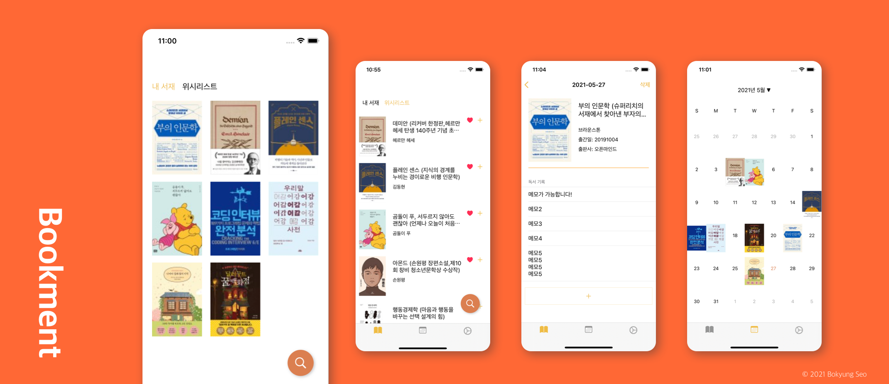
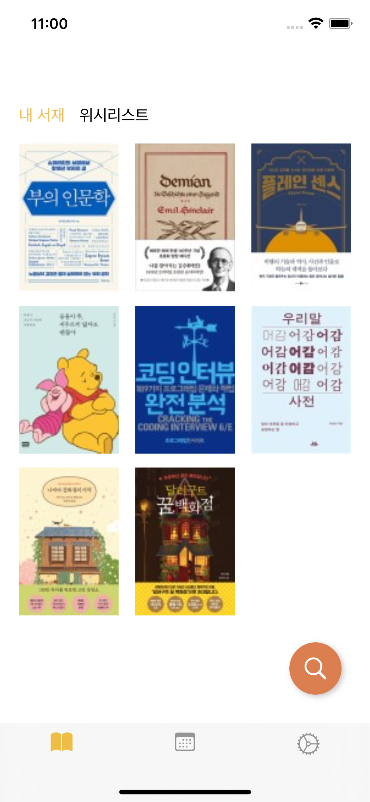
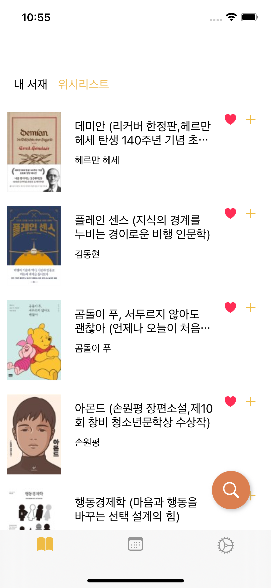
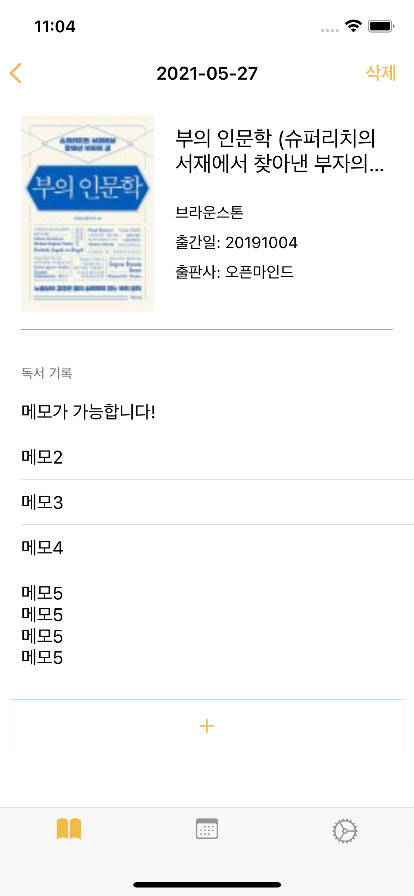
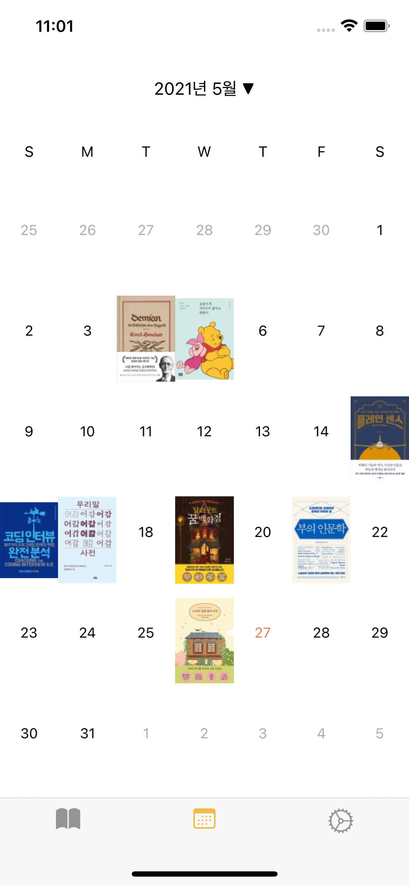

# Bookment (북멘트)

	

 

네이버 검색API를 활용하여 도서 정보 검색을 돕고 독서 기록도 남길 수 있는 iOS 애플리케이션 Bookment 프로젝트입니다.📚

 
 

## 주요 기능

	
	
	
	

 
 

- 도서 검색
- 도서 위시리스트 및 서재 등록
- 독서 기록 남기기
- 독서 캘린더 기록

 
 

## 지원

- 북멘트 애플리케이션은 iOS 13 이후부터 지원됩니다.
- help: maybutter756@gmail.com

 
 
